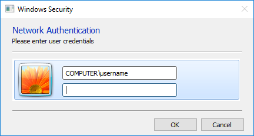

# PyCred v0.0.1
##### A message from the developer

_Frustrated  with tkinter, I wanted to try something else. Enter PyQt. I wrote this quick script up as a way to learn Qt. I am sure the code could be better, inline documentation would probably be nice. Any who...._

PyCred mimics the Windows Security prompt for Network Authentication on Windows 7. It pulls the domain\computer name and username from environment variables to prefill the username line (this makes it look more legit). The password dialog autofocuses.

If they user clicks cancel the script hides the window, randomly delays choice([60,120, 240, 480]) seconds, and then redisplays the window after the timer.  

If the user enters a password and clicks OK or hits enter the script verifies the credentials with win32security. If the password is incorrect the script delays randomly choice([1,2,3,4]) seconds clears out the previous password and re-prompts. 

If the password verifies the script writes the domain, username, and password to pwd.bin.

The script will run till a successful password is entered for the current user or the password "snakesonaplane" is entered. Though the user can change the username, the script uses environmental variables for the domain and username. _I should change this in the future so it fails back to this and uses the values in the username textbox instead._

I "compiled" the script and it's assets using the PyCred.spec file with pyinstaller. You can find a binary in Project/dist/

## Prerequisite
I used [WinPython-32bit-3.4.4.3Qt5](https://sourceforge.net/projects/winpython/files/WinPython_3.4/3.4.4.3/) and [WinPython-64bit-3.4.4.3Qt5](https://sourceforge.net/projects/winpython/files/WinPython_3.4/3.4.4.3/) only installing [PyInstaller](http://www.pyinstaller.org/) to each. However, most will not be using this python environment.

* Windows machine (this won't work for linux/osx, but it wasn't designed for them either so....)
* Preferable Windows 7 so the art matches the OS. _Though only the very astute will notice if you run this in XP/Vista/8/8.1/10._
* [Python 3.4.4](https://www.python.org/downloads/release/python-344/)
* [PyQT5](https://www.riverbankcomputing.com/software/pyqt/download5)
* [win32security (from PyWin32)](https://sourceforge.net/projects/pywin32/)
* [PyInstaller](http://www.pyinstaller.org/) (if you wish to compile)

